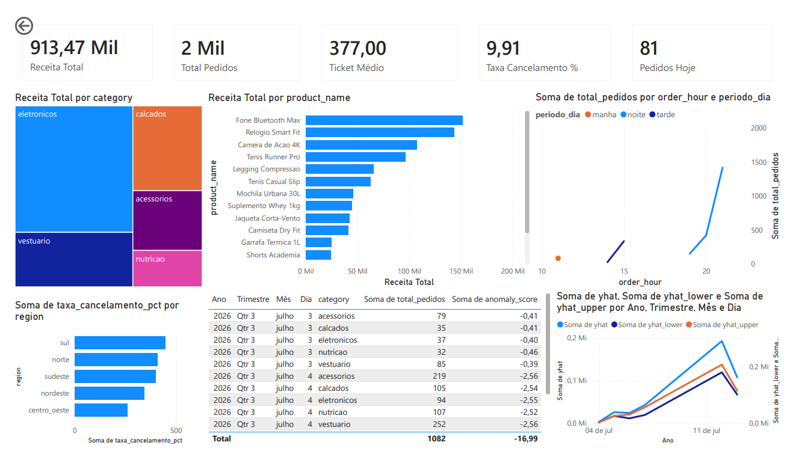

# 🛒 E-commerce Data Pipeline


Pipeline de dados **end-to-end** simulando um e-commerce near real-time — da ingestão até o dashboard e previsão de demanda com ML. Construído para demonstrar maturidade técnica em engenharia de dados com stack moderna.

---

## 📊 Dashboard



> Conectado direto ao PostgreSQL, schema `gold`. Atualiza a cada run do pipeline (15 minutos).

---

## 🏗️ Arquitetura

```
┌─────────────────────────────────────────────────────────────────┐
│                     Apache Airflow (DAG: ecommerce_pipeline)     │
│              schedule: */15 * * * *  |  retries: 3              │
└──────────┬──────────┬──────────┬──────────┬───────────┬─────────┘
           │          │          │          │           │
           ▼          ▼          ▼          ▼           ▼
    [generate_data] [bronze]  [silver]   [gold/dbt]  [ml]
           │          │          │          │           │
           ▼          ▼          ▼          ▼           ▼
      data/raw/   bronze.*   silver.*   gold.*    gold.demand_forecast
      JSON files  orders_raw orders_clean fact_orders gold.anomaly_flags
                  (JSONB)    (Polars)    (dbt)     (sklearn)
```

### Arquitetura Medallion

| Camada | Tabela principal | Responsabilidade | Ferramenta |
|--------|-----------------|------------------|------------|
| **Bronze** | `bronze.orders_raw` | Dado cru, sem transformação, auditável | Polars + psycopg2 |
| **Silver** | `silver.orders_clean` | Dado limpo, 10 regras de qualidade aplicadas | Polars |
| **Gold** | `gold.fact_orders` + dims | Star schema, KPIs, pronto para consumo | dbt |
| **ML** | `gold.demand_forecast` | Previsão de demanda 7 dias, anomalias | scikit-learn |

---

## ⚡ Como rodar (em 3 comandos)

### Pré-requisitos
- [Docker Desktop](https://www.docker.com/products/docker-desktop/) instalado e rodando

```bash
# 1. Clone o repositório
git clone https://github.com/seu-usuario/ecommerce-pipeline.git
cd ecommerce-pipeline

# 2. Configure as variáveis de ambiente
cp .env.example .env   # edite as senhas se quiser

# 3. Suba tudo
docker compose up -d
```

Aguarde ~2 minutos e acesse:

| Serviço | URL | Credencial |
|---------|-----|------------|
| **Airflow** | http://localhost:8080 | admin / admin |
| **pgAdmin** | http://localhost:5050 | admin@pipeline.dev / pgadmin_pass_123 |
| **PostgreSQL** | localhost:5432 | pipeline_user / pipeline_pass_123 |

### Disparar o pipeline manualmente
```bash
# Via Airflow UI: DAG "ecommerce_pipeline" → Trigger DAG
# Ou via CLI:
docker compose exec --user airflow airflow-webserver \
  airflow dags trigger ecommerce_pipeline
```

### Rodar o ML separadamente
```bash
docker compose exec pipeline python ml/ml_demand_forecast.py
```

---

## 🔄 Pipeline end-to-end

```
start
  └── check_db_health     → verifica se o PostgreSQL está respondendo
        └── generate_data → gera 50 eventos fake com Faker (e-commerce)
              └── ingest_bronze  → JSON → bronze.orders_raw (sem transformação)
                    └── process_silver → Polars aplica 10 regras de qualidade
                          └── build_gold → dbt run (star schema + KPIs)
                                └── run_ml → LinearRegression + IsolationForest
                                      └── log_summary → métricas de auditoria
```

**Robustez:**
- 3 retries com backoff exponencial (2→4→8 min)
- `max_active_runs=1` — sem runs paralelas no mesmo dado
- `on_failure_callback` — alerta estruturado em caso de falha
- `SqlSensor` — só avança se o banco estiver saudável

---

## 📁 Estrutura do projeto

```
ecommerce-pipeline/
├── dags/
│   ├── dag_ecommerce_pipeline.py  # DAG mestre (orquestra tudo)
│   ├── dag_bronze_ingest.py       # DAG Bronze standalone
│   └── dag_silver_transform.py    # DAG Silver standalone
├── ingestion/
│   ├── generator.py               # Gerador de eventos fake
│   └── bronze_ingest.py           # Ingestão Bronze
├── processing/
│   └── silver_transform.py        # Transformação Silver (Polars)
├── dbt/
│   └── ecommerce_gold/
│       └── models/
│           ├── dimensions/        # dim_product, dim_customer, dim_date
│           ├── facts/             # fact_orders
│           └── kpis/              # kpi_ticket_medio, kpi_volume, kpi_cancelamento
├── ml/
│   └── ml_demand_forecast.py      # LinearRegression + IsolationForest
├── sql/
│   └── init.sql                   # Cria schemas bronze/silver/gold
├── dashboard/
│   └── dashboard_ecommerce.pbix   # Power BI Desktop
├── docs/
│   ├── dashboard_preview.png
│   └── silver_quality_rules.md    # 10 regras de qualidade documentadas
├── docker-compose.yml
├── Dockerfile.pipeline
├── requirements.txt
└── .env.example
```

---

## 🧹 Qualidade de dados — Camada Silver

A camada Silver aplica **10 regras de qualidade** com Polars antes de promover os dados:

| Código | Regra | Ação |
|--------|-------|------|
| RQ-01 | Duplicatas por `order_id` | Descarta (mantém mais recente) |
| RQ-02 | Preço nulo | Descarta |
| RQ-03 | Preço negativo | Descarta |
| RQ-04 | Quantidade nula ou ≤ 0 | Descarta |
| RQ-05 | `customer_id` nulo | Descarta |
| RQ-06 | Timestamp no futuro (> now + 1h) | Descarta |
| RQ-07 | Status inválido | Corrige → `unknown` |
| RQ-08 | Categoria | Normaliza (lowercase, sem acento) |
| RQ-09 | `total_value` | Recalcula como `price × quantity` |
| RQ-10 | Textos vazios | Converte para NULL |

Taxa de aproveitamento esperada: **~90%** dos eventos gerados.
Detalhamento por regra disponível em `silver.transform_log` (JSONB).

Documentação completa: [`docs/silver_quality_rules.md`](docs/silver_quality_rules.md)

---

## 📊 Perguntas de negócio respondidas

As tabelas Gold respondem diretamente com SQL simples:

```sql
-- Qual categoria gera mais receita?
SELECT category, SUM(receita_total) AS receita
FROM gold.kpi_ticket_medio_por_categoria
GROUP BY category ORDER BY receita DESC;

-- Em que horário o volume é maior?
SELECT order_hour, periodo_dia, SUM(total_pedidos) AS pedidos
FROM gold.kpi_volume_pedidos_por_hora
GROUP BY order_hour, periodo_dia ORDER BY pedidos DESC;

-- Qual região tem maior taxa de cancelamento?
SELECT region, ROUND(AVG(taxa_cancelamento_pct), 1) AS taxa
FROM gold.kpi_taxa_cancelamento
GROUP BY region ORDER BY taxa DESC;

-- Qual a previsão de demanda para os próximos 7 dias?
SELECT category, forecast_date, yhat AS pedidos_previstos
FROM gold.demand_forecast ORDER BY category, forecast_ts;
```

---

## 🤖 Machine Learning

| Modelo | Objetivo | Tabela de saída |
|--------|----------|-----------------|
| `LinearRegression` | Previsão de demanda horária (7 dias) | `gold.demand_forecast` |
| `IsolationForest` | Detecção de anomalias no volume | `gold.anomaly_flags` |

O ML está integrado ao pipeline como task nativa do Airflow — não é um notebook isolado. Roda automaticamente após cada atualização da Gold.

---

## 🛠️ Stack técnica

| Componente | Tecnologia | Por quê |
|------------|-----------|---------|
| Processamento | **Polars** | 5-10x mais rápido que Pandas, lazy evaluation, API expressiva |
| Orquestração | **Apache Airflow** | DAGs, retries, observabilidade, padrão de mercado |
| Modelagem | **dbt** | SQL versionado, testes automáticos, documentação gerada |
| Banco | **PostgreSQL** | JSONB para Bronze, schemas medallion, free e robusto |
| ML | **scikit-learn** | Sem conflitos de dependência, simples e eficaz |
| Containerização | **Docker Compose** | Ambiente reproduzível em qualquer máquina |
| Visualização | **Power BI** | Conector nativo PostgreSQL, mercado brasileiro |

---

## 💡 Decisões técnicas

**Por que Polars em vez de Pandas?**
Polars usa Apache Arrow internamente e executa operações em paralelo por padrão. Para o volume deste projeto (~1k eventos/hora) a diferença é marginal, mas a escolha demonstra conhecimento de ferramentas modernas. Em datasets maiores (>1GB) a diferença é de 5-10x.

**Por que arquitetura Medallion (Bronze/Silver/Gold)?**
Cada camada tem uma responsabilidade clara: Bronze garante auditabilidade (nada é perdido), Silver garante confiança (dado validado), Gold garante consumibilidade (dado modelado para o negócio). Isso permite reprocessar qualquer camada de forma independente sem perder histórico.

**Por que dbt na camada Gold em vez de SQL puro?**
dbt traz versionamento, testes automáticos (unicidade, not_null, accepted_values), documentação gerada e a capacidade de ver o lineage dos dados. O `dbt test` rodando no CI garante que os modelos estão íntegros antes de chegar ao dashboard.

---

## 🐛 Problemas encontrados durante o desenvolvimento

**1. Surrogate keys duplicadas na `dim_product`**

Ao conectar o Power BI, o relacionamento `fact_orders → dim_product`
falhou com erro de cardinalidade muitos-para-muitos. Investigando no
pgAdmin, identifiquei que o mesmo `product_id` aparecia com múltiplas
linhas na dimensão, o `generate_surrogate_key` gerava o mesmo hash
para o mesmo produto, mas o `GROUP BY product_id, product_name, category`
criava linhas extras por variações mínimas de preço entre lotes.

Solução: adicionei uma CTE `deduped` com `ROW_NUMBER() OVER (PARTITION BY product_id ORDER BY last_seen_at DESC)` e filtrei `WHERE rn = 1`.

```sql
-- Antes: GROUP BY gerava duplicatas
group by product_id, product_name, category

-- Depois: deduplicação explícita
deduped as (
    select *,
        row_number() over (
            partition by product_id
            order by last_seen_at desc
        ) as rn
    from source
)
select ... from deduped where rn = 1
```

---

**2. `stddev()` retornando NULL e quebrando `is_anomalia`**

O KPI de volume por hora calculava `is_anomalia` comparando o total de
pedidos com `média + 2 * desvio_padrão`. Em dias com apenas uma hora de
dados, `stddev()` retorna NULL no PostgreSQL (comportamento correto
matematicamente), o que fazia `is_anomalia` ficar NULL em vez de `false`.

Isso só apareceu quando rodei `dbt test` e percebi que a coluna tinha
valores nulos onde não deveria.

Solução: `COALESCE(stddev(...), 0)` para tratar a partição de linha única.

```sql
-- Antes: NULL propagava para is_anomalia
stddev(total_pedidos) over (partition by data) as desvio_pedidos_dia

-- Depois: desvio zero quando há só uma linha
COALESCE(stddev(total_pedidos) over (partition by data), 0) as desvio_pedidos_dia
```

---

**3. `generate_series` quebrando na primeira run com Silver vazia**

Na primeira execução do pipeline, a `dim_date` falhava com erro
`invalid input syntax for type date` porque `min(order_ts)` retornava
NULL (Silver ainda sem dados), e `generate_series(NULL, NULL, interval '1 day')`
não é válido no PostgreSQL.

Solução: `COALESCE` com `current_date` como fallback.

```sql
-- Antes: NULL quebrava o generate_series
(select date_trunc('day', min(order_ts)) from silver.orders_clean)

-- Depois: current_date como fallback seguro
COALESCE(
    (select date_trunc('day', min(order_ts)) from silver.orders_clean),
    current_date
)
```

---

**4. Prophet incompatível com Polars moderno**

Ao tentar usar Prophet para previsão de demanda, o modelo falhava com
`TypeError: read_csv() got an unexpected keyword argument 'infer_schema'`
porque o `cmdstanpy` (dependência interna do Prophet) usava uma API
antiga do Polars que foi removida na versão 0.20+.

Solução: migrei para `LinearRegression` do scikit-learn, que não tem
conflitos de dependência e é suficiente para o volume de dados do projeto.
O modelo treina em <1s e gera previsões com intervalo de confiança baseado
nos resíduos do treino.

## 📄 Licença

MIT — sinta-se livre para usar, adaptar e melhorar.